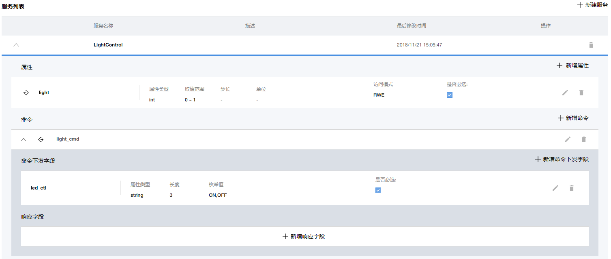
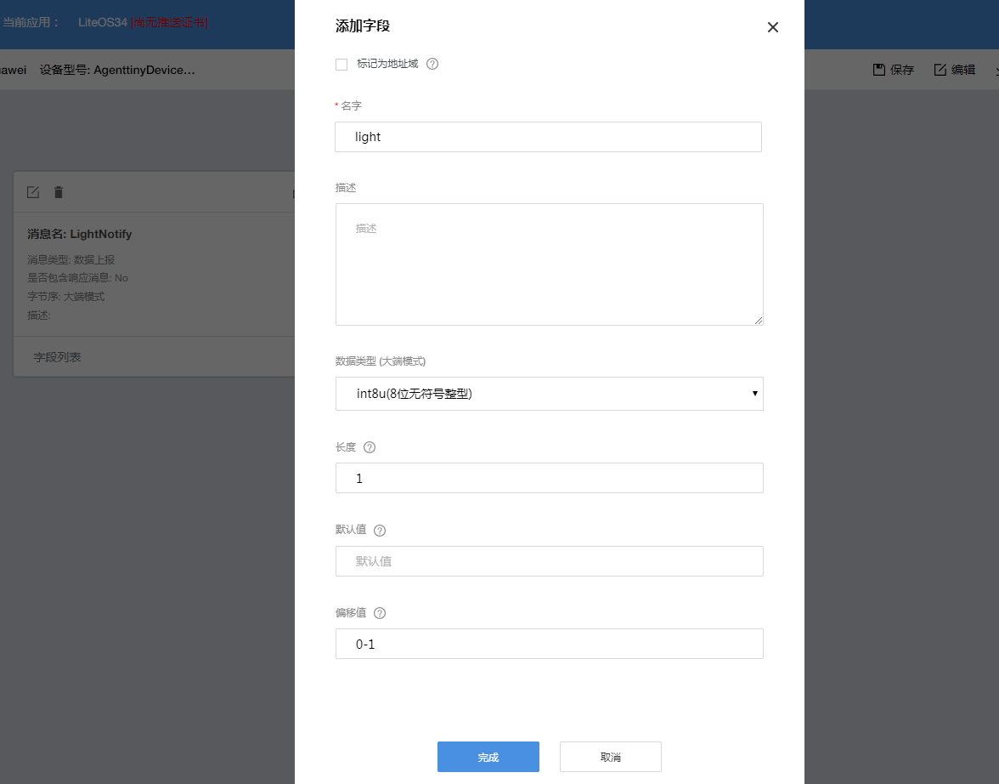
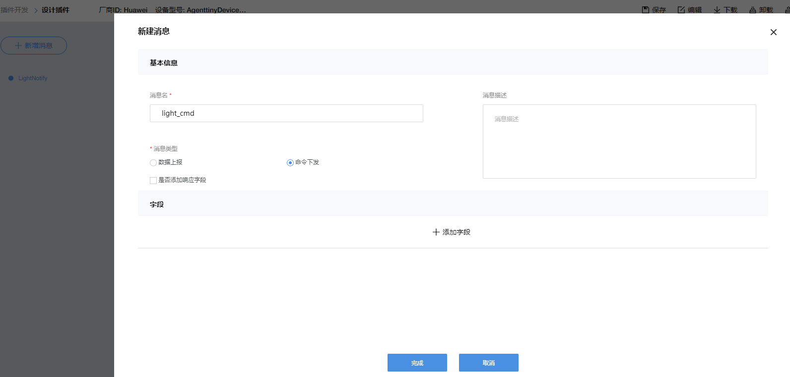
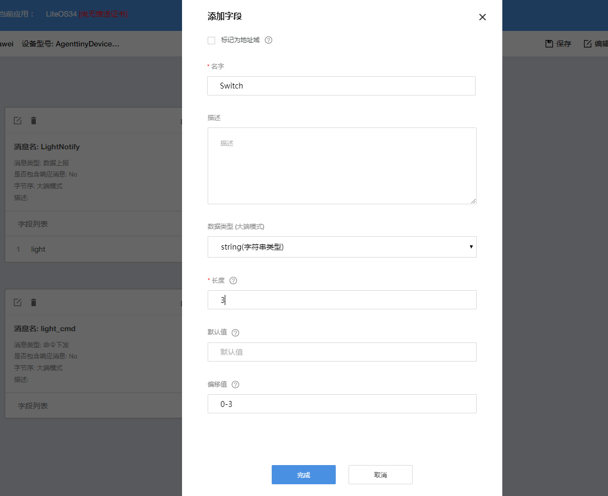
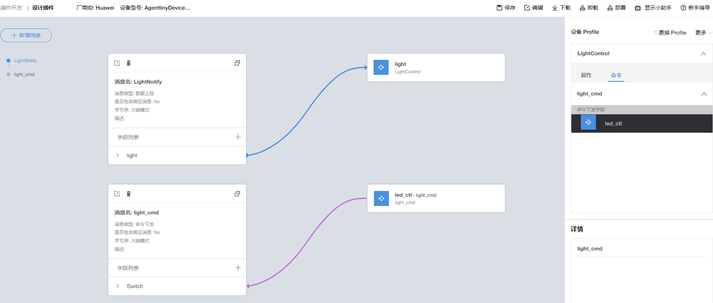
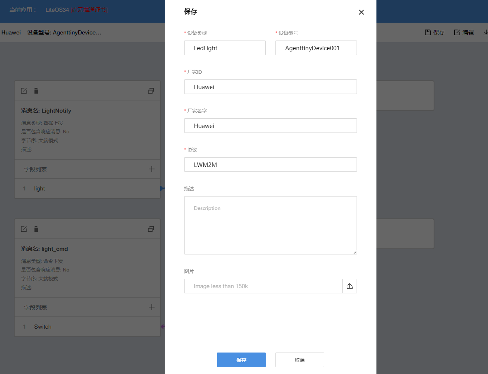
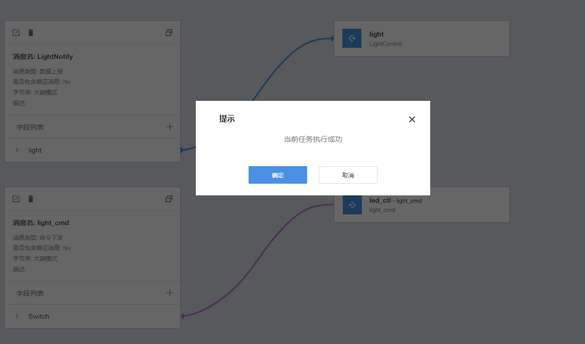
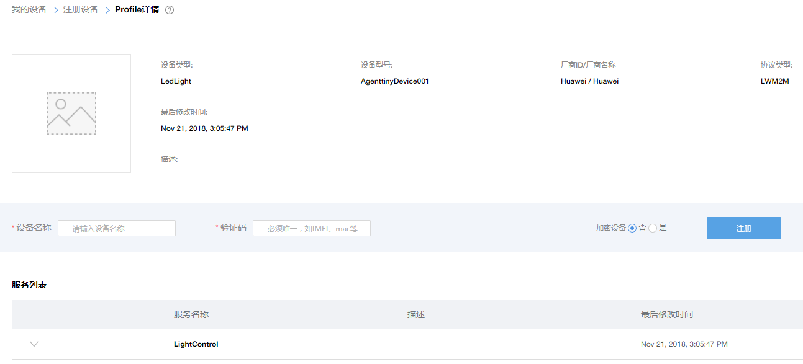
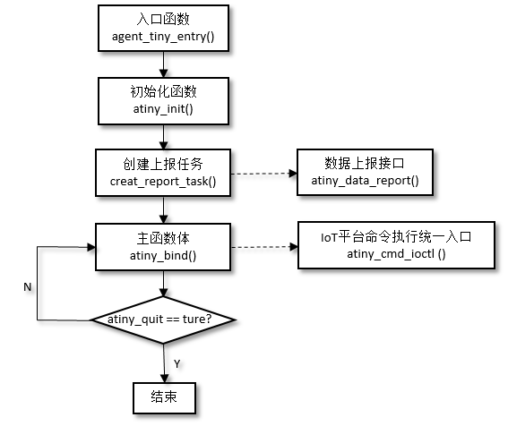

# Huawei LiteOS SDK 端云互通组件
# 开发指南

## 目 录

* [1 知识共享许可协议说明](#1)

* [2 前言](#2)

* [3 LiteOS SDK端云互通组件概述](#3)
  * [3.1 背景介绍](#3.1)

  * [3.2 系统方案](#3.2)

  * [3.3 集成策略](#3.3)

  * [3.4 安全](#3.4)

  * [3.5 升级](#3.5)

* [4 设备接入OceanConnect集成开发流程](#4)
  * [4.1 云侧配置流程](#4.1)
    * [4.1.1 环境准备](#4.1.1)

    * [4.1.2 创建应用](#4.1.2)

    * [4.1.3 开发Profile文件](#4.1.3)

    * [4.1.4 开发编解码插件](#4.1.4)

    * [4.1.5 注册设备](#4.1.5)
  * [4.2 端侧对接流程](#4.2)

    * [4.2.1 环境准备](#4.2.1)
    * [4.2.2 数据结构介绍](#4.2.2)
    * [4.2.3 LiteOS SDK端云互通组件入口函数](#4.2.3)
    * [4.2.4 LiteOS SDK端云互通组件初始化](#4.2.4)
    * [4.2.5 创建数据上报任务](#4.2.5)
    * [4.2.6 LiteOS SDK端云互通组件命令处理接口](#4.2.6)
    * [4.2.7 LiteOS SDK端云互通组件主函数体](#4.2.7)
  * [4.3 小节](#4.3)
* [5  LiteOS端云互通组件实战演练](#5)
  * [5.1 开发环境准备](#5.1)
  * [5.2 端云互通组件以太网接入实例](#5.2)
    * [5.2.1 接入IoT平台](#5.2.1)
    * [5.2.2 数据上报](#5.2.2)
    * [5.2.3 命令下发](#5.2.3)
  * [5.3 （参考）端云互通组件无线接入实例](#5.3)
    * [5.3.1 无线接入介绍](#5.3.1)
    * [5.3.2 AT框架介绍](#5.3.2)
    * [5.3.3 移植WIFI模块-ESP8266](#5.3.3)
    * [5.3.4 移植GSM模块-SIM900A](#5.3.4)
  * [5.4 （参考）设备模拟器接入平台](#5.4)
    * [5.4.1 设备模拟器接入平台](#5.4.1)
    * [5.4.2 设备模拟器数据上报](#5.4.2)
    * [5.4.2 应用模拟器命令下发](#5.4.2)
* [6 附录1 LwM2M协议介绍](#6)
  * [6.1 LwM2M协议是什么](#6.1)

  * [6.2 LwM2M协议特性](#6.2)

  * [6.3 LwM2M体系架构](#6.3)

  * [6.4 LwM2M对象定义](#6.4)

  * [6.5 LwM2M资源定义](#6.5)

  * [6.6 LwM2M接口定义](#6.6)

  * [6.7 固件升级](#6.7)

<h2 id="1">1.知识共享许可协议说明</h2>

**您可以自由地：**

**分享** — 在任何媒介以任何形式复制、发行本作品

**演绎** — 修改、转换或以本作品为基础进行创作

只要你遵守许可协议条款，许可人就无法收回你的这些权利。

**惟须遵守下列条件：**

**署名** —
您必须提供适当的证书，提供一个链接到许可证，并指示是否作出更改。您可以以任何合理的方式这样做，但不是以任何方式表明，许可方赞同您或您的使用。

**非商业性使用** — 您不得将本作品用于商业目的。

**相同方式共享** —
如果您的修改、转换，或以本作品为基础进行创作，仅得依本素材的授权条款来散布您的贡献作品。

**没有附加限制** —
您不能增设法律条款或科技措施，来限制别人依授权条款本已许可的作为。

**声明：**

当您使用本素材中属于公众领域的元素，或当法律有例外或限制条款允许您的使用，则您不需要遵守本授权条款。

未提供保证。本授权条款未必能完全提供您预期用途所需要的所有许可。例如：形象权、隐私权、著作人格权等其他权利，可能限制您如何使用本素材。


为了方便用户理解，这是协议的概述。您可以访问网址https://creativecommons.org/licenses/by-nc-sa/3.0/legalcode

了解完整协议内容。

<h2 id="2">2.前言</h2>

**目的**

本文档用于指导开发者了解Huawei LiteOS端云互通组件，能够基于LiteOS
SDK对接物联网平台，开发自己的物联网应用。

**读者对象**

本文档主要适用于Huawei LiteOS的开发者。

本文档主要适用于以下对象：

* 物联网端侧软件开发工程师

* 物联网架构设计师

**符号约定**

在本文中可能出现下列标志，它们所代表的含义如下。

| 符号                                       | 说明                                                                                                                          |
|--------------------------------------------|-------------------------------------------------------------------------------------------------------------------------------|
|    | 用于警示潜在的危险情形，若不避免，可能会导致人员死亡或严重的人身伤害                                                          |
|    | 用于警示潜在的危险情形，若不避免，可能会导致中度或轻微的人身伤害                                                              |
|    | 用于传递设备或环境安全警示信息，若不避免，可能会导致设备损坏、数据丢失、设备性能降低或其它不可预知的结果 “注意”不涉及人身伤害 |
|    | “说明”不是安全警示信息，不涉及人身、设备及环境伤害信息                                                                        |

**术语**

| 序号 | 术语名称     | 描述                                                                                                                                                                                                                            |
|------|--------------|---------------------------------------------------------------------------------------------------------------------------------------------------------------------------------------------------------------------------------|
| 1    | LiteOS SDK   | LiteOS SDK是Huawei LiteOS软件开发工具包（Software Development Kit），包括端云互通组件、FOTA、JS引擎、传感框架等内容。                                                                                                           |
| 2    | 南向设备     | 用于采集数据的嵌入式设备，比如STM32开发板，或者温湿度采集的传感器等。                                                                                                                                                           |
| 3    | 北向应用     | 用于查看IoT云平台上南向设备上报数据或者给南向设备下发控制命令的手机APP或者PC端的应用程序。                                                                                                                                      |
| 4    | 设备profile  | 用于描述南向设备具有的能力以及上报的数据的格式的一组json格式文件，这些文件需要上传到IoT云平台上。                                                                                                                               |
| 5    | 编解码插件   | 用于将南向设备上报的私有数据解析成设备profile描述的并且IoT云平台能够识别和存储的数据，以及将北向应用下发的命令编码成南向设备能够识别的数据格式的一组函数组成的jar文件。简而言之就是南向设备和云平台之间的一个数据转换的程序。   |
| 6    | AT指令       | AT指令集是从终端设备（Terminal Equipment，TE)或数据终端设备（Data Terminal Equipment，DTE)向终端适配器(Terminal Adapter，TA)或数据电路终端设备(Data Circuit Terminal Equipment，DCE)发送的。本文通过AT指令操作WIFI或者GSM模组。 |
| 7    | 端云互通组件 | 端云互通组件是华为物联网解决方案中，资源受限终端对接到 IoT云平台的重要组件。                                                                                                                                                    |
| 8    | OceanConnect | 华为IoT联接管理平台（IoT Connection Management Platform）是面向运营商和企业/行业领域的统一开放云平台，支持SIM和非SIM场景的各种联接和联接管理。                                                                                  |


编解码插件和设备profile是一对一的关系，即一个设备profile只能对应一个编解码插件。APP和编解码插件的关系是一对多的关系，即一个APP下面可以同时关联多个编解码插件。

<h2 id="3">3.LiteOS SDK端云互通组件概述</h2>

<h3 id="3.1">3.1 背景介绍</h3>

LiteOS SDK是Huawei LiteOS软件开发工具包（Software Development Kit），包括端云互通组件、FOTA、JS引擎、传感框架等内容。

本文档介绍的LiteOS SDK包括了LiteOS SDK端云互通组件。端云互通组件是华为物联网解决方案中，资源受限终端对接到IoT云平台的重要组件。端云互通组件提供端云协同能力，集成了 LwM2M、CoAP、mbedTLS、LwIP 等全套 IoT 互联互通协议栈，且在 LwM2M的基础上，提供端云互通组件开放API，用户只需关注自身的应用，而不必关注 LwM2M实现细节，直接使用 LiteOS SDK端云互通组件封装的API，通过四个步骤就能简单快速地实现与华为 OceanConnect IoT平台安全可靠连接。使用LiteOS SDK端云互通组件，用户可以大大减少开发周期，聚焦自己的业务开发，快速构建自己的产品。

**Huawei LiteOS架构图**


<h3 id="3.2">3.2 系统方案</h3>

Huawei LiteOS
SDK端云互通组件针对单模组、单MCU和外置MCU+模组两种应用场景，提供了不同的软件架构：

**单模组/单MCU软件架构**


**MCU+芯片/模组软件架构**


LiteOS SDK 端云互通组件软件主要由三个层次构成：

+ **开放API层：** LiteOS SDK端云互通组件的开放API为应用程序定义了通用接口，终端设备调用开放API能快速完成华为OceanConnect
    IoT平台的接入、业务数据上报、下发命令处理等。对于外置MCU+模组的场景，LiteOS
    SDK端云互通组件还提供了AT 命令适配层，用于对AT命令做解析。

+ **协议层：** LiteOS SDK端云互通组件集成了LwM2M/CoAP/DTLS/TLS/UDP等协议。

+ **驱动及网络适配层：**
    LiteOS SDK端云互通组件为了方便终端设备进行集成和移植，提供了驱动及网络适配层，用户可以基于SDK提供的适配层接口列表，根据具体的硬件平台适配硬件随机数、内存管理、日志、数据存储以及网络Socket等接口。

**LiteOS基础内核：** 为用户终端设备提供RTOS特性。

<h3 id="3.3">3.3集成策略</h3>

#### 3.3.1可集成性

LiteOS
SDK端云互通组件作为独立的组件，不依赖特定的芯片架构和网络硬件类型，可以轻松地集成到各种通信模组上，如NB-IoT模组、eMTC模组、WIFI模组、GSM模组、以太网硬件等。

#### 3.3.2可移植性

LiteOS
SDK端云互通组件的Adapter层提供了常用的硬件及网络适配接口，终端或者模组厂家可以根据自己的硬件实现这些接口后，即可完成LiteOS
SDK端云互通组件的移植。需要移植的接口列表及相关函数如下：

**LiteOS SDK端云互通组件需要移植适配的接口列表**

| 接口分类           | 接口名                 | 说明                 |
|--------------------|------------------------|----------------------|
| 网络Socket相关接口 | atiny_net_connect      |                      |
|                    | atiny_net_recv         |                      |
|                    | atiny_net_send         |                      |
|                    | atiny_net_recv_timeout |                      |
|                    | atiny_net_close        |                      |
| 硬件相关接口       | atiny_gettime_ms       | 获取系统时间，单位ms |
|                    | atiny_usleep           | 延时函数，单位us     |
|                    | atiny_random           | 硬件随机数函数       |
|                    | atiny_malloc           | 动态内存申请         |
|                    | atiny_free             | 动态内存释放         |
|                    | atiny_snprintf         | 格式化字符串         |
|                    | atiny_printf           | 日志输出             |
| 资源互斥相关接口   | atiny_mutex_create     |                      |
|                    | atiny_mutex_destroy    |                      |
|                    | atiny_mutex_lock       |                      |
|                    | atiny_mutex_unlock     |                      |


LiteOS
SDK端云互通组件支持OS方式移植，也支持无OS方式移植，推荐使用支持OS方式移植。

* **LiteOS
    SDK端云互通组件支持固件升级，需要适配atiny_storage_devcie_s对象，供组件使用。**

```C
    atiny_storage_devcie_s *atiny_get_hal_storage_device(void);  
  
    struct atiny_storage_device_tag_s;  
    typedef struct atiny_storage_device_tag_s atiny_storage_device_s;  
    struct atiny_storage_device_tag_s  
    {  
        //设备初始化  
        int (*init)( storage_device_s *this);  
        //准备开始写  
        int (*begin_software_download)( storage_device_s *this);  
        //写软件，从offset写，buffer为内容，长度为len  
        int (*write_software)( storage_device_s *this , uint32_t offset,         const char *buffer, uint32_t len);  
  
        //下载结束  
        int (*end_software_download)( storage_device_s *this);  
        //激活软件  
        int (*active_software)( storage_device_s *this);  
        //得到激活的结果, 0成功，1失败  
        int (*get_active_result)( storage_device_s *this);  
        //写update_info, 从offset写，buffer为内容，长度为len  
        int (*write_update_info)( storage_device_s *this, long offset, const char *buffer, uint32_t len);  
        //读update_info, 从offset写，buffer为内容，长度为len  
        int (*read_update_info)( storage_device_s *this, long offset, char *buffer, uint32_t len);  
};
```

#### 3.3.3集成约束

LiteOS SDK端云互通组件集成需要满足一定的硬件规格：

* 要求模组/芯片有物理网络硬件支持，能支持UDP协议栈。

* 模组/芯片有足够的Flash和RAM资源供LiteOS
    SDK端云互通组件协议栈做集成。建议的硬件选型规格如下表所示：

**硬件选型规格建议**

| RAM   | Flash  |
|-------|--------|
| \>32K | \>128K |


推荐的硬件选型规格考虑LiteOS
SDK端云互通组件本身占用的资源（开放API+物联网协议栈+安全协议+SDK驱动及网络适配层），也考虑用户业务demo的最小实现占用的资源（芯片驱动程序、传感器驱动程序、基本业务流程等）。该规格仅为推荐规格，具体选型需要用户根据自身业务再做评估。

<h3 id="3.4">3.4 安全</h3>

LiteOS SDK端云互通组件支持DTLS(Datagram Transport Layer
Security)，即数据包传输层安全性协议。目前支持PSK(Pre-Shared
Keys)预共享密钥模式，后续会扩展支持其他模式。

LiteOS
SDK端云互通组件首先和物联网开放平台完成握手流程，后续的应用数据将全部为加密数据，如图所示：

**DTLS协议交互流程**


<h3 id="3.5">3.5 升级</h3>

LiteOS
SDK端云互通组件支持物联网开放平台的远程固件升级，且具备断点续传、固件包完整性保护等特性。

固件升级功能和流程如图所示：

**固件升级功能示意图**


**固件升级流程示意图**


<h2 id="4">4.设备接入OceanConnect集成开发流程</h2>

本章将分别从IoT平台侧和端侧详细地阐述端云互通组件的开发流程，旨在帮助开发者在IoT设备上集成LiteOS SDK端云互通组件，进行IoT应用开发和调测。LiteOS SDK端云互通组件接入华为OceanConnect IoT云平台默认采用的是以太网方式（即以太网口驱动+LwIP网络协议栈+LwM2M协议+LiteOS SDK端云互通组件对接云平台），同时也支持WIFI、GSM、NB-IoT等无线方式。

OceanConnect即华为IoT联接管理平台（IoT Connection Management Platform）是面向运营商和企业/行业领域的统一开放云平台，支持SIM和非SIM场景的各种联接和联接管理。通过开放的APIs，向上集成各种行业应用，向下接入各种传感器、终端和网关，帮助运营商和企业/行业客户实现多种行业终端的快速接入，多种行业应用的快速集成。华为IoT联接管理平台提供安全可控的全联接管理，使能行业革新，构建IoT生态（本章中提到的IoT平台指OceanConnect）。

<h3 id="4.1">4.1云侧配置流程</h3>

<h4 id="4.1.1">4.1.1环境准备</h4>

在开发之前，需要提前获取如下信息：

* 开发者Portal的访问地址/账号/密码

>   需要向OceanConnect IoT平台申请。

* 设备对接地址/端口号

<h4 id="4.1.2">4.1.2创建应用</h4>

通过创建应用，开发者可以根据自身应用的特征，选择不同的平台服务套件，降低应用开发难度。

* **步骤1** 登录OceanConnect IoT平台的开发者Portal。开发者Portal的访问地址、账号和密码需要向IoT平台服务商申请。

* **步骤2** 登录界面会跳出弹框，提示“当前账号没有应用！请先创建应用！”，点击“创建应用”。

**创建应用**


* **步骤3** 在新弹出窗口中，配置应用信息，点击“确定”。

配置示例如下图，点击“确定”后，IoT平台会返回应用ID和应用密钥，请妥善保存应用密钥，以便于应用服务器接入平台时使用。如果遗忘密钥，需要通过“对接信息”-\>"重置密钥”进行重置。

**配置应用**


如上配置仅为参考举例，具体配置请以现网需求为准。

**应用创建成功**


----**结束**

<h4 id="4.1.3">4.1.3开发Profile文件</h4>

Profile文件用来描述设备类型和设备服务能力。它定义了设备具备的服务能力，每个服务具备的属性、命令以及命令参数。

* **步骤1** 登录IoT平台的开发者Portal。开发者Portal的访问地址、账号和密码需要向IoT平台服务商申请。

* **步骤2** 选择“Profile开发”-\>“Profile在线开发”-\>“自定义产品”，点击右上角“+创建全新产品”。

IoT平台提供了Profile模板库，开发者可以根据自己需要，选择合适的模板直接使用。如果在模板库中未找到需要的Profile，再自己定义，示例如下。

**创建Profile文件**


如上配置仅为参考举例，具体配置请以现网需求为准。

* **步骤3** 选择新创建的Profile文件，点击“新建服务”，配置设备的服务能力。

可参考“Profile开发”-\>“Profile在线开发”中的“产品模板”进行配置。例如新建一个名为LightControl的服务，包含一种属性light（灯的亮灭状态）和一种命令light_cmd（设置灯亮on或者灭off）。

**新建LightControl服务**



* **步骤4** （可选）开发者Portal提供了Profile文件的导出功能。

选择“Profile开发”-\>“Profile在线开发”-\>新创建的Profile文件，点击右上角“导出该产品Profile”，可以对线上开发的Profile文件进行导出。

**导出Profile文件**


----**结束**

<h4 id="4.1.4">4.1.4开发编解码插件</h4>

IoT设备和IoT平台之间采用LwM2M协议通信，LwM2M消息的数据为应用层数据，应用层数据的格式由设备厂商自行定义。由于IoT设备对省电要求较高，所以应用层数据一般采用二进制格式。IoT平台在对应用层数据进行协议解析时，会转换成统一的json格式，以方便应用服务器使用。要实现二进制消息与json格式消息的转换，IoT平台需要使用编解码插件。

* **步骤1** 选择“插件开发”-\>“插件开发”-\>“开始设计”，点击右上角“+新建插件”。在弹出框中，选择Profile文件。

IoT平台提供了插件模板库，开发者可以根据自己需要，选择合适的模板直接使用。如果在模板库中未找到需要的插件，再自己定义。

**创建插件**


* **步骤2** 点击“新增消息”，配置二进制码流和Profile属性/命令/命令响应的映射关系。

可参考“插件开发”-\>“插件开发”-\>“开始设计”中的“新手指导”和“插件模板”进行配置。

**开发插件（新建数据上报消息）**


**开发插件（添加字段）**



**开发插件（新建命令下发消息）**



**开发插件（添加字段）**



编解码插件的开发，即定义：

* **Profile** 文件定义的属性/响应在设备上报的二进制码流中的位置，以便于平台对设备上报数据和命令响应进行解码。

* **Profile** 文件定义的命令在平台下发的二进制码流中的位置，以便于平台对下发命令进行编码。

**二进制码流和Profile文件的映射关系**



* **步骤3** 点击右上角“部署”。

点击部署后，需要先“保存”插件，之后才开始部署。部署需要等待时间小于60s。

**保存插件**



**部署插件**



* **步骤4** （可选）开发者Portal提供了编解码插件的下载功能。

选择“插件开发”-\>“插件开发”-\>新开发的编解码插件，点击右上角“下载”，可以对线上开发的编解码插件进行导出。

----**结束**

<h4 id="4.1.5">4.1.5注册设备</h4>

应用服务器需要调用IoT平台的注册设备接口，在IoT平台添加设备。

* **步骤1** 选择“我的设备”-\>“注册设备”-\>“需要注册设备的Profile”，输入设备名称和验证码（verifyCode），并根据业务需求选择是否加密设备。最后点击“注册”。



注册设备后，IoT平台会返回设备ID和PSK码，请妥善保存。新增注册的设备状态为“未绑定（not bound）”。

**注册设备**


----**结束**

<h3 id="4.2">4.2 端侧对接流程</h3>

设备接入IoT平台后，IoT平台才可以对设备进行管理。设备接入平台时，需要保证IoT平台已经有对应应用，并且已经在该应用下注册了此设备。本节介绍端侧设备是如何通过端云互通组件与IoT平台实现对接的。首先给出端侧设备对接IoT平台的整体示意图。



本小节将根据上图所示的流程，向开发者介绍终端设备是如何一步步地接入IoT平台，并进行数据上报与命令执行的。
<h4 id="4.2.1">4.2.1 环境准备</h4>

在开发之前，需要提前获取如下信息：

* Huawei LiteOS及LiteOS SDK源代码

>   目前托管在GitHub，地址为<https://github.com/LiteOS/LiteOS>

* 集成开发工具：
  - MDK 5.18版本或者以上版本，从MDK官方网站下载。   

  - MDK依赖的pack包

>   说明：MDK工具需要license，请从MDK官方获取。

<h4 id="4.2.2">4.2.2 数据结构介绍</h4>

* 平台下发命令枚举类型

```C
typedef enum  
{  
    ATINY_GET_MANUFACTURER,         /*获取厂商名字*/
    ATINY_GET_MODEL_NUMBER,         /*获取设备模型，由厂商定义和使用*/
    ATINY_GET_SERIAL_NUMBER,        /*获取设备序列号*/
    ATINY_GET_FIRMWARE_VER,         /*获取固件版本号*/
    ATINY_DO_DEV_REBOOT,            /*下发设备复位命令*/ 
    ATINY_DO_FACTORY_RESET,         /*厂商复位*/
    ATINY_GET_POWER_SOURCE,         /*获取电源*/
    ATINY_GET_SOURCE_VOLTAGE,       /*获取设备电压*/
    ATINY_GET_POWER_CURRENT,        /*获取设备电流*/
    ATINY_GET_BATERRY_LEVEL,        /*获取电池剩余电量*/
    ATINY_GET_MEMORY_FREE,          /*获取空闲内存*/
    ATINY_GET_DEV_ERR,              /*获取设备状态，比如内存耗尽、电池不足等*/
    ATINY_DO_RESET_DEV_ERR,         /*获取设备复位状态*/
    ATINY_GET_CURRENT_TIME,         /*获取当前时间*/
    ATINY_SET_CURRENT_TIME,         /*设置当前时间*/
    ATINY_GET_UTC_OFFSET,           /*获取UTC时差*/
    ATINY_SET_UTC_OFFSET,           /*设置UTC时差*/
    ATINY_GET_TIMEZONE,             /*获取时区*/
    ATINY_SET_TIMEZONE,             /*设置时区*/
    ATINY_GET_BINDING_MODES,        /*获取绑定模式*/
    ATINY_GET_FIRMWARE_STATE,       /*获取固件升级状态*/
    ATINY_GET_NETWORK_BEARER,       /*获取网络通信承载类型，比如GSM、WCDMA等*/
    ATINY_GET_SIGNAL_STRENGTH,      /*获取网络信号强度*/
    ATINY_GET_CELL_ID,              /*获取网络小区ID*/
    ATINY_GET_LINK_QUALITY,         /*获取网络链路质量*/ 
    ATINY_GET_LINK_UTILIZATION,     /*获取网络链路利用率*/
    ATINY_WRITE_APP_DATA,           /*业务数据下发命令字*/
    ATINY_UPDATE_PSK,               /*更新psk命令字*/
    ATINY_GET_LATITUDE,             /*获取设备所处纬度*/
    ATINY_GET_LONGITUDE,            /*获取设备所处经度*/
    ATINY_GET_ALTITUDE,             /*获取设备所处高度*/
    ATINY_GET_SPEED,                /*获取设备运行速度*/
    ATINY_GET_TIMESTAMP,            /*获取时间戳*/
} atiny_cmd_e;
```

* 关键事件枚举类型

该枚举类型用于LiteOS SDK端云互通组件把自身状态通知用户  

```C
typedef enum  
{  
    ATINY_REG_OK,              /*设备注册成功*/ 
    ATINY_REG_FAIL,            /*设备注册失败*/ 
    ATINY_DATA_SUBSCRIBLE,     /*数据开始订阅，设备侧允许上报数据 */ 
    ATINY_DATA_UNSUBSCRIBLE,   /*数据取消订阅 ，设备侧停止上报数据*/ 
    ATINY_FOTA_STATE           /*固件升级状态*/
} atiny_event_e;
```

* LwM2M协议参数结构体

```C
typedef struct  
{  
    char* binding;                             /*目前支持U或者UQ*/
    int   life_time;                           /*LwM2M协议生命周期，默认50000*/
    unsigned int  storing_cnt;                 /*lwm2m缓存区总字节个数*/
} atiny_server_param_t;
```

* 安全及服务器参数结构体

```C
typedef struct  
{  
    bool  is_bootstrap;      /*是否bootstrap服务器*/ 
    char* server_ip;         /*服务器ip，字符串表示，支持ipv4和ipv6*/ 
    char* server_port;       /*服务器端口号*/ 
    char* psk_Id;            /*预置共享密钥ID*/ 
    char* psk;               /*预置共享密钥*/ 
    unsigned short psk_len;  /*预置共享密钥长度*/ 
} atiny_security_param_t;

```

* 上报数据的枚举类型

用户上报数据的数据类型，用户根据自身应用扩展

```C
typedef enum  
{  
    FIRMWARE_UPDATE_STATE = 0，  /*设备固件升级状态*/ 
    APP_DATA                     /*用户数据*/ 
} atiny_report_type_e;

```

* 服务器参数结构体

```C
typedef struct  
{  
    atiny_server_param_t   server_params;  
    atiny_security_param_t security_params[2];  /*支持一个IOT服务器，一个bootstrap服务器*/ 
} atiny_param_t;
```

* 终端设备参数结构体

```C
typedef struct  
{  
    char* endpoint_name;    /*北向申请产生的设备标识码*/ 
    char* manufacturer;     /*北向申请产生的厂商名称*/
    char* dev_type;         /*北向申请产生的设备类型*/
} atiny_device_info_t;
```
* 数据上报数据结构

以下枚举值，表述了用户上报的数据，最终的反馈类型，比如数据发送成功，数据发送但未得到确认，具体定义如下：  

```C
typedef enum  
{  
    NOT_SENT = 0,        /*待上报的数据未发送*/ 
    SENT_WAIT_RESPONSE,  /*待上报的数据已发送，等待响应*/ 
    SENT_FAIL,           /*待上报的数据发送失败*/ 
    SENT_TIME_OUT,       /*待上报的数据已发送，等待响应超时*/ 
    SENT_SUCCESS,        /*待上报的数据发送成功*/ 
    SENT_GET_RST,        /*待上报的数据已发送，但对端响应RST报文*/ 
    SEND_PENDING,        /*待上报的数据等待发送*/ 
} data_send_status_e;  
 
//用户使用以下数据结构上报数据： 
typedef struct _data_report_t  
{  
    atiny_report_type_e type;    /*数据上报类型，比如业务数据，电池剩余电量等 */  
    int cookie;                  /*数据cookie,用以在ack回调中，区分不同的数据*/  
    int len;                     /*数据长度，不应大于MAX_REPORT_DATA_LEN*/  
    uint8_t* buf;                /*数据缓冲区首地址*/  
    atiny_ack_callback callback; /*ack回调，其入参取值data_send_status_e类型 */  
} data_report_t;
```

<h4 id="4.2.3">4.2.3 LiteOS SDK端云互通组件入口函数</h4>

使用LiteOS SDK端云互通组件agent tiny对接IoT平台，首先需要一个入口函数```agent_tiny_entry()```。

| 接口名                      | 描述                                                         |
| --------------------------- | ------------------------------------------------------------ |
| void agent_tiny_entry(void) | LiteOS SDK端云互通组件的入口函数。该接口将进行agent tiny的初始化相关操作，创建上报任务，并调用agent tiny主函数体。<br>参数列表：空<br>返回值：空 |

开发者可以通过LiteOS内核提供的任务机制，创建一个主任务main_task。在主任务中调用入口函数```agent_tiny_entry()```，开启agent tiny工作流程。

```c
    UINT32 creat_main_task()
    {
        UINT32 uwRet = LOS_OK;
        TSK_INIT_PARAM_S task_init_param;
        task_init_param.usTaskPrio = 0;
        task_init_param.pcName = "main_task";
        task_init_param.pfnTaskEntry = (TSK_ENTRY_FUNC)main_task;
        task_init_param.uwStackSize = 0x1000;
        uwRet = LOS_TaskCreate(&g_TskHandle, &task_init_param);
        if(LOS_OK != uwRet)
        {
            return uwRet;
        }
        return uwRet;
    }
```

<h4 id="4.2.4">4.2.4 LiteOS SDK端云互通组件初始化</h4>

在入口函数中，需要调用```atiny_init()```进行agent tiny的初始化相关操作。

| 接口名                                                       | 描述                                                         |
| ------------------------------------------------------------ | ------------------------------------------------------------ |
| int   atiny_init(atiny_param_t* atiny_params, void** phandle) | LiteOS SDK端云互通组件的初始化接口，由LiteOS SDK端云互通组件实现，设备调用。<br>参数列表：参数```atiny_params```为入参，包含初始化操作所需的各个变量，具体请参考服务器参数结构体```atiny_param_t```；参数```phandle```为出参，表示当前创建的agent tiny的句柄。<br>返回值：整形变量，标识初始化成功或失败的状态。 |

对于入参```atiny_params```的设定，要根据具体的业务来进行。比如，是否需要加密（打开或关闭宏定义```WITH_DTLS```），等等。若需要加密，则服务器端的接口号```server_port```应设为5684，且需要设置在IoT平台上注册设备时所提供的PSK码；若不需要加密，服务器端的接口号应设为5683，且不需要PSK码。终端设备相关的参数```device_info```需要与IoT平台上注册的设备参数一致，包括设备验证码```g_endpoint_name```（或```g_endpoint_name_s```，取决于是否加密），设备厂商```manufacturer```和设备类型```dev_type```等。服务器相关参数，也需要开发者根据业务需要进行设定，包括服务器地址```server_ip```，LwM2M协议的生命周期```life_time```，缓存数据报文个数```storing_cnt```等等。

```C
    UINT32 uwRet = LOS_OK;
    atiny_param_t* atiny_params;
    atiny_security_param_t  *security_param = NULL;
    atiny_device_info_t *device_info = &g_device_info;
    if(NULL == device_info)
    {
        return;
    }
#ifdef WITH_DTLS
    device_info->endpoint_name = g_endpoint_name_s;
#else
    device_info->endpoint_name = g_endpoint_name;
#endif
    device_info->manufacturer = "Huawei";

    atiny_params = &g_atiny_params;
    atiny_params->server_params.binding = "UQ";
    atiny_params->server_params.life_time = LWM2M_LIFE_TIME;
    atiny_params->server_params.storing_cnt = 0;

    security_param = &(atiny_params->security_params[0]);
    security_param->is_bootstrap = FALSE;
    security_param->server_ip = DEFAULT_SERVER_IPV4;
#ifdef WITH_DTLS
    security_param->server_port = "5684";
    security_param->psk_Id = g_endpoint_name_s;
    security_param->psk = (char*)g_psk_value;
    security_param->psk_len = 16;
#else
    security_param->server_port = "5683";
    security_param->psk_Id = NULL;
    security_param->psk = NULL;
    security_param->psk_len = 0;
#endif
    //用上面定义的初始化参数进行agent tiny的初始化
    if(ATINY_OK != atiny_init(atiny_params, &g_phandle))  
    {
        return;
    }
```

设定好atiny_params后，即可根据设定的参数对agent tiny进行初始化。对于初始化接口```atiny_init()```内部，主要进行入参合法性的检验，agent tiny所需资源的创建等工作，一般不需要开发者进行修改。

<h4 id="4.2.5">4.2.5 创建数据上报任务</h4>

在完成agent tiny的初始化后，需要通过调用```creat_report_task()```创建一个数据上报的任务```app_data_report()```。

```c
    UINT32 creat_report_task()
    {
        UINT32 uwRet = LOS_OK;
        TSK_INIT_PARAM_S task_init_param;
        UINT32 TskHandle;
        task_init_param.usTaskPrio = 1;
        task_init_param.pcName = "app_data_report";
        task_init_param.pfnTaskEntry = (TSK_ENTRY_FUNC)app_data_report;
        task_init_param.uwStackSize = 0x400;
        uwRet = LOS_TaskCreate(&TskHandle, &task_init_param);
        if(LOS_OK != uwRet)
        {
            return uwRet;
        }
        return uwRet;
    }
```
在```app_data_report()```中应该完成对数据上报数据结构```data_report_t```的赋值，包括数据缓冲区地址```buf```，收到平台ack响应后的回调函数```callback```，数据```cookie```，数据长度```len```，以及数据上报类型```type```（在这里固定为```APP_DATA```）。

```C
    uint8_t buf[5] = {0, 1, 6, 5, 9};
    data_report_t report_data;
    int ret = 0;
    int cnt = 0;
    report_data.buf = buf;
    report_data.callback = ack_callback;
    report_data.cookie = 0;
    report_data.len = sizeof(buf);
    report_data.type = APP_DATA;
```

完成对```report_data```的赋值后，即可通过接口```atiny_data_report()```上报数据。

| 接口名                                                       | 描述                                                         |
| ------------------------------------------------------------ | ------------------------------------------------------------ |
| int atiny_data_report(void* phandle, data_report_t* report_data) | LiteOS SDK端云互通组件数据上报接口，由LiteOS SDK端云互通组件实现，设备调用，设备应用数据使用该接口上报。该接口为阻塞接口，不允许在中断中使用。<br>参数列表：参数```phandle```为调用初始化接口```atiny_init()```得到的agent tiny的句柄；参数```report_data```为数据上报数据结构。<br>返回值：整形变量，标识数据上报成功或失败的状态。 |

上报任务一般的实现方法是在一个无限循环中，每隔一定的时延就调用一次```atiny_data_report()```，不断地进行业务数据上报。

```C
    while(1)
    {
        report_data.cookie = cnt;
        cnt++;
        ret = atiny_data_report(g_phandle, &report_data);   //数据上报接口
        ATINY_LOG(LOG_DEBUG, "data report ret: %d\n", ret);
        (void)LOS_TaskDelay(250 * 8);
    }
```

<h4 id="4.2.6">4.2.6 LiteOS SDK端云互通组件命令处理接口</h4>
IoT平台下发的各类命令，都通过接口```atiny_cmd_ioctl()```来具体执行。

| 接口名                                                     | 描述                                                         |
| ---------------------------------------------------------- | ------------------------------------------------------------ |
| int atiny_cmd_ioctl (atiny_cmd_e cmd, char* arg, int len); | LiteOS SDK端云互通组件申明和调用，由开发者实现。该接口是LwM2M标准对象向设备下发命令的统一入口。<br/>参数列表：参数```cmd```为具体命令字，比如下发业务数据，下发复位，升级命令等；参数```arg```为存放命令参数的缓存；参数```len```为缓存大小。<br>返回值：空。 |

```atiny_cmd_ioctl()```是LiteOS SDK端云互通组件定义的一个通用可扩展的接口，其命令字如```atiny_cmd_e```所定义，用户根据自身需求进行选择性实现，也可以根据自身需求进行扩展。常用的接口定义如下表所示，每一个接口都和atiny_cmd_e的枚举值一一对应：

| 回调接口函数                                             | 描述                                                         |
| -------------------------------------------------------- | ------------------------------------------------------------ |
| int atiny_get_manufacturer(char* manufacturer,int len)   | 获取厂商名字，参数manufacturer指向的内存由LiteOS SDK端云互通组件分配，户填充自身的厂商名字，长度不能超过参数len。 |
| int atiny_get_dev_type(char * dev_type,int len)          | 获取设备类型，参数dev_type指向的内存由LiteOS SDK端云互通组件分配，户填充自身的设备类型，长度不能超过参数len。 |
| int atiny_get_model_number((char * model_numer, int len) | 获取设备模型号，参数model_numer指向的内存由LiteOS SDK端云互通组件分配，户填充自身的设备模型号，长度不能超过参数len。 |
| int atiny_get_serial_number(char* num,int len)           | 获取设备序列号，参数numer指向的内存由LiteOS SDK端云互通组件分配，户填充自身的设备序列号，长度不能超过参数len。 |
| int atiny_get_dev_err(int* arg，int len)                 | 获取设备状态，比如内存耗尽、电池不足、信号强度低等，参数arg由LiteOS SDK端云互通组件分配，用户填充，长度不能超过len。 |
| int atiny_do_dev_reboot(void)                            | 设备复位。                                                   |
| int atiny_do_factory_reset(void)                         | 厂商复位。                                                   |
| int atiny_get_baterry_level(int* voltage)                | 获取电池剩余电量。                                           |
| int atiny_get_memory_free(int* size)                     | 获取空闲内存大小。                                           |
| int atiny_get_total_memory(int* size)                    | 获取总共内存大小。                                           |
| int atiny_get_signal_strength(int* singal_strength)      | 获取信号强度。                                               |
| int atiny_get_cell_id(long* cell_id)                     | 获取小区ID。                                                 |
| int atiny_get_link_quality(int* quality)                 | 获取信道质量。                                               |
| int atiny_write_app_write(void* user_data, int len)      | 业务数据下发。                                               |
| int atiny_update_psk(char* psk_id, int len)              | 预置共享密钥更新。                                           |

其中，开发者需要根据自身的业务，在接口```atiny_write_app_write()```中实现自己的命令响应。

```c
    int atiny_write_app_write(void* user_data, int len)
    {
        (void)atiny_printf("write num19 object success\r\n");
        return ATINY_OK;
    }
```

<h4 id="4.2.7">4.2.7 LiteOS SDK端云互通组件主函数体</h4>

完成了数据上报任务的创建与命令处理接口的实现，agent tiny进入到对接IoT平台的核心步骤```atiny_bind()```。

| 接口名                                                       | 描述                                                         |
| ------------------------------------------------------------ | ------------------------------------------------------------ |
| int   atiny_bind(atiny_device_info_t* device_info, void* phandle) | LiteOS SDK端云互通组件的主函数体，由LiteOS SDK端云互通组件实现，设备调用，调用成功后，不会返回。该接口是LiteOS SDK端云互通组件主循环体，实现了LwM2M协议处理，注册状态机，重传队列，订阅上报。<br>参数列表：参数```device_info```为终端设备参数结构体；参数```phandle```为调用初始化接口```atiny_init()```得到的agent tiny的句柄。<br>返回值：整形变量，标识LiteOS SDK端云互通组件主函数体执行的状态。只有执行失败或者调用了LiteOS SDK端云互通组件去初始化接口```atiny_deinit()```才会返回。 |

```atiny_bind()```会根据LwM2M协议标准，进行LwM2M客户端创建与注册，并将数据上报任务```app_data_report()```中上报的数据递交给通信模块发送到IoT平台，同时接受IoT平台下发的命令消息，解析后由命令处理接口```atiny_cmd_ioctl()```统一进行处理。与```atiny_init()```一样，```atiny_bind()```内部一般不需要开发者进行修改。

> 说明：关于LwM2M协议相关内容，请开发者参考附录。

LiteOS SDK端云互通组件通过主函数体，不断地进行数据上报与命令处理。当调用LiteOS SDK端云互通组件去初始化接口```atiny_deinit()```时，退出主函数体。

| 接口名                            | 描述                                                         |
| --------------------------------- | ------------------------------------------------------------ |
| void atiny_deinit(void* phandle); | LiteOS SDK端云互通组件的去初始化接口，由LiteOS SDK端云互通组件实现，设备调用。该接口为阻塞式接口，调用该接口时，会直到agent tiny主任务退出，资源释放完毕，该接口才会退出。<br>参数列表：参数```phandle```为调用```atiny_init()```获取到的LiteOS SDK端云互通组件句柄。<br>返回值：空 |

<h3 id="4.3">4.3 小结</h3>

本章从终端设备对接IoT平台的具体流程出发，分别从云侧和端侧详细地阐述了端云互通组件的开发流程。在云侧，本章介绍了创建应用，制作profile，部署编解码插件，注册设备的具体步骤；在端侧，本章从LiteOS SDK端云互通组件的入口函数开始介绍，开发者只需要根据自己的具体业务，实现数据上报任务与命令响应接口，通过LiteOS SDK端云互通组件提供的接口，可以很容易地对接到IoT平台：

```c
    if(ATINY_OK != atiny_init(atiny_params, &g_phandle))  //初始化
    {
        return;
    }
    uwRet = creat_report_task();   //创建数据上报任务
    if(LOS_OK != uwRet)
    {
        return;
    }
    (void)atiny_bind(device_info, g_phandle);   //主函数体
```
通过本章的内容，希望开发者能够掌握LiteOS SDK端云互通组件开发流程，进行IoT应用开发和调测。

<h2 id="5">5.LiteOS端云互通组件实战演练</h2>

LiteOS SDK端云互通组件接入华为OceanConnect IoT云平台既可以通过以太网方式，同时也支持WIFI、GSM、NB-IoT等无线方式。对于这两种不同的方式，本章将通过具体的实例，指导开发者针对自身的开发环境，对LiteOS SDK端云互通组件进行配置，并最终对接IoT平台。对于其中涉及的AT框架相关概念，本章中也会进行简单的介绍。

<h3 id="5.1">5.1 开发环境准备</h3>


- LiteOS SDK端云互通组件代码：

  ```git clone https://github.com/LiteOS/LiteOS.git```

- 硬件设备：野火STM32F429开发板，调试下载器（J-Link、ST-Link等）、网线、路由器。

> 说明：本章以野火STM32F429IG开发板为例进行介绍，板子的详细资料可以从<http://www.firebbs.cn/forum.php>下载。

**STM32F429IG_FIRE开发板外设**


<h3 id="5.2">5.2 端云互通组件以太网接入实例</h3>

#### 5.2.1 接入IoT平台

**步骤1** 开发板的网口通过网线连接到路由器。

**步骤2** 设置本地IP。

在sys_init.c中修改device接入的局域网的IP地址值。目前demo程序采用的是静态IP地址的方式，如果需要使用DHCP方式，请在main.c中顶部头文件包含之后定义USE_DHCP宏即可。

```C
void net_init(void) 
{ 
    /* IP addresses initialization */ 
    IP_ADDRESS[0] = 192; 
    IP_ADDRESS[1] = 168; 
    IP_ADDRESS[2] = 0; 
    IP_ADDRESS[3] = 115; 
    NETMASK_ADDRESS[0] = 255; 
    NETMASK_ADDRESS[1] = 255; 
    NETMASK_ADDRESS[2] = 255; 
    NETMASK_ADDRESS[3] = 0; 
    GATEWAY_ADDRESS[0] = 192; 
    GATEWAY_ADDRESS[1] = 168; 
    GATEWAY_ADDRESS[2] = 0; 
    GATEWAY_ADDRESS[3] = 1;
}
```
> 注意：接口```net_init()```的调用在agent tiny入口函数```agent_tiny_entry()```之前，作用是完成lwip协议相关的初始化。

**步骤3** 网口的mac地址修改。

在eth.c中将MAC_ADDR0\~MAC_ADDR5修改成真实的mac地址值保证不重复。

```C
static int8_t eth_init(struct netif* netif) 
{ 
    HAL_StatusTypeDef hal_eth_init_status; 
    MACAddr[0] = 0x00; 
    MACAddr[1] = 0x80; 
    MACAddr[2] = 0xE1; 
    MACAddr[3] = 0x00; 
    MACAddr[4] = 0x00; 
    MACAddr[5] = 0x00;
} 
```
> 注意：接口```eth_init()```将在步骤2中的```net_init()```中被调用。

**步骤4** 设置云平台IP以及设备EP Name和PSK。

现在需要设定相关配置参数。这些参数将作为入参传入```atiny_init()```以对LiteOS端云互通组件进行初始化。EP Name就是在云平台上注册设备时开发者设定的验证码，必须保证是唯一的；而PSK（预共享密钥）是用来加密传输的秘钥，agent_tiny_demo.c中示例如下：

```C
#define DEFAULT_SERVER_IPV4 "192.168.0.5"
char * g_endpoint_name = "44440003"; 
#ifdef WITH_DTLS 
char *g_endpoint_name_s = "11110006"; 
unsigned char g_psk_value[16] = {0xef,0xe8,0x18,0x45,0xa3,0x53,0xc1,0x3c,0x0c,0x89,0x92,0xb3,0x1d,0x6b,0x6a,0x96};  
#endif
```

**步骤5** 编译并运行程序。

**步骤6** 查看设备状态。

登录IoT平台开发者Portal，选择“我的设备”，在设备列表中查看对应设备的状态。如果状态为“绑定（bound）”，则表示设备已经成功接入IoT平台。

**查看设备状态**


----**结束**

#### 5.2.2 数据上报

本文档在第四章中详细介绍了LiteOS SDK端云互通组件设备进行数据上报的完整流程。对于开发者来说，只需要获取传感器数据，并在接口```app_data_report()```中将其传递给数据上报结构体```report_data```即可。具体调测过程如下：

**步骤1** 在设备侧执行app_data_report函数，使设备上报数据。

修改agent_tiny_demo.c中的函数app_data_report如下：

```C
struct Led_Light
{
uint8_t lightvalue;
…
};
extern get_led_lightvalue (void);  //获取传感器数据
void app_data_report(void)
{
    struct Led_Light light;
    data_report_t report_data;
    int ret;
    int cnt = 0;
    report_data.buf = (uint8_t *)&light;
    report_data.callback = ack_callback;
    report_data.cookie = 0;
    report_data.len = sizeof(struct Led_Light);
    report_data.type = APP_DATA;
    while(1)
    {
        report_data.cookie = cnt;
        cnt++;
        ret = atiny_data_report(g_phandle, &report_data);
        printf("report ret:%d\n",ret);
        (void)LOS_TaskDelay(250*8);
    }
}
```

**步骤2** 查看设备状态

登录IoT平台的开发者Portal，在“我的设备”界面的设备列表中，选择上报数据的设备，查看“历史数据”，验证设备数据上报的情况。

**使用LiteOS SDK端云互通组件的IoT设备数据上报业务流程**


**查看数据上报结果**


----**结束**

#### 5.2.3 命令下发

命令下发一般分为两种形式：立即下发和缓存下发。

* **立即下发：** IoT平台立即发送收到的命令，如果设备不在线或者设备没收到指令则下发失败。立即下发适合对命令实时性有要求的场景，比如路灯开关灯，燃气表开关阀。使用立即下发时，应用服务器需要自己保证命令下发的时机。

**命令立即下发流程**


* **缓存下发：** 平台收到命令后放入队列。在设备上线的时候，平台依次下发命令队列中的命令。缓存下发适合对命令实时性要求不高的场景，比如配置水表的参数。缓存下发平台根据设备的省电模式进行不同处理。

**命令缓存下发流程**


应用服务器向IoT平台下发命令时，携带参数expireTime（简称TTL，表示最大缓存时间）。如果不带expireTime，则默认expireTime为48小时。

expireTime=0：命令立即下发。

expireTime\>0：命令缓存下发。

LiteOS SDK端云互通组件场景命令下发的调测过程：

**命令下发步骤如下**

**步骤1** 登录IoT平台的开发者Portal。开发者Portal的访问地址、账号和密码需要向IoT平台服务商申请。

**步骤2** 在“我的设备”界面的设备列表中，选择接收命令的设备，点击“命令下发（\</\>)”。在弹出界面中，配置下发给设备的命令参数。

**命令下发**


**步骤3** 在“我的设备”界面的设备列表中，选择接收命令的设备-\>“历史命令”，查看“状态”栏的显示。

**命令下发状态**


状态说明如下：

* **超期：** 表示命令在IoT平台缓存时间超期，未向设备下发。

* **成功：** 表示IoT平台已经将命令下发给设备，且收到设备上报的命令执行结果。

* **失败：** 表示编解码插件解析为空，或执行结果响应里面有“ERROR CODE”等。

* **超时：** 表示IoT平台等待ACK响应超时。

* **取消：** 表示应用侧已经取消命令下发。

* **等待：** 表示命令在IoT平台缓存，还未下发给设备。

* **已发送：** 表示IoT平台已经将命令下发给设备。

* **已送达：** 表示IoT平台已经将命令下发给设备，且收到设备返回的ACK消息。

**步骤4** LiteOS SDK端云互通组件从消息缓存中获取消息码流并解析，根据解析结果执行```atiny_cmd_ioctl()```函数中对应的回调函数（实际调用```atiny_write_app_write()```处理下发命令）。

```C
struct Led_Light
int atiny_write_app_write(void* user_data, int len)
{
    int i;
    uint8_t cmd_data[len];
    memcpy(cmd_data, user_data, len);
    for(i=0;i<len;i++)
    {
        //打印下发的命令数据，用户可以处理下发的命令，根据具体的命令控制硬件设备
        printf("########   %d",cmd_data[i]);
    }
    (void)atiny_printf("write num19 object success\r\n");
    return ATINY_OK;
}
```
----**结束**

<h3 id="5.3">5.3（参考）端云互通组件无线接入实例</h3>

#### 5.3.1 无线接入介绍

无线的接入方式包括WIFI、GSM、NB-IoT、Zigbee、蓝牙等，本节主要介绍WIFI和GSM（GPRS）的接入方式。对物联网开发者来说，WIFI或者GSM一般都是一个单独的模块，运行在MCU上的LiteOS SDK端云互通组件需要使用WIFI或者GSM提供的网络服务时，需要通过串口AT指令就可以了，如下图所示，ESP8266是乐鑫的WIFI模组，SIM900A是SIMCom芯讯通推出的GSM/GPRS模组。

**Huawei LiteOS SDK端云互通组件无线接入方案示意图**


AT 即Attention，AT指令集是从终端设备 (Terminal Equipment，TE)或者数据终端设备(Data Terminal Equipment，DTE)向终端适配器(Terminal Adapter，TA)或数据电路终端设备 (Data Circuit Terminal Equipment，DCE)发送的。通过TA，TE发送AT指令来控制移动台(Mobile Station，MS)的功能，与GSM 网络业务进行交互。用户可以通过AT指令进行呼叫、短信、电话本、数据业务、传真等方面的控制。

#### 5.3.2 AT框架介绍 

不论使用ESP8266还是SIM900A，都可以使用AT+UART方式接入，主要的差别在于具体的AT指令，但很多情况下都是类似的，LiteOS SDK端云互通组件提供了一种AT框架，也可以称之为AT模板，方便用户移植不同串口通信模块（需要支持TCP/IP协议栈），AT框架的方案如下图所示。

**AT框架方案结构图**


结构图中AT Socket用于适配Atiny Socket接口，类似posix socket，AT Send用于调用at_cmd发送AT命令，AT Recv用于AT Analyse Task，通过LiteOS消息队列Post消息到用户接收任务。AT Analyse Task的主要功能是解析来自串口的消息，包括用户数据和命令的响应，串口USART主要是在中断或者DMA模式下接收数据，AT API Register是提供设备模块注册的API函数。

结构图中深蓝色的部分是AT框架公共部分代码，开发者不需要修改；浅蓝色的部分是设备相关代码，开发者需要编写相应的设备代码，根据at_api_interface.h文件的定义，开发者只要实现以下函数接口即可：

```C
typedef struct { 
    int32_t  (*init)(void);  /*初始化，初始化串口、IP网络等*/ 
    int8_t (*get_localmac)(int8_t *mac);/*获取本地MAC*/ 
    int8_t (*get_localip)(int8_t *ip, int8_t * gw, int8_t * mask);/*获取本地IP*/ 
    /*建立TCP或者UDP连接*/ 
    int32_t  (*connect)(const int8_t * host, const int8_t *port, int32_t proto); 
    /*发送，当命令发送后，如果超过一定的时间没收到应答，要返回错误*/ 
    int32_t  (*send)(int32_t id , const uint8_t  *buf, uint32_t len); 
    int32_t  (*recv_timeout)(int32_t id , int8_t  *buf, uint32_t len, int32_t timeout); 
    int32_t  (*recv)(int32_t id , int8_t  *buf, uint32_t len); 
     
    int32_t  (*close)(int32_t id);/*关闭连接*/ 
    int32_t  (*recv_cb)(int32_t id);/*收到各种事件处理，暂不实现 */ 
    int32_t  (*deinit)(void); 
}at_adaptor_api;
```
无论使用WIFI接入还是GPRS接入，开发者实现上述接口后，通过AT API Register进行注册，得到一组设备无关的对外接口，供上层的Agent Socket调用。

#### 5.3.3 移植WIFI模块-ESP8266

上一小节中，本文对AT框架进行了简单的介绍。其中需要开发者实现at_api_interface.h中所定义的接口，之后通过AT API Register进行注册，供上层的Agent Socket调用。本节给出WIFI模块ESP8266的具体例子，帮助开发者进行移植。

**步骤1** STM32F429开发板上连接ESP8266 串口wifi模块，如下图所示：


**步骤2** 首先在设备文件esp8266.c定义API结构体。

```C
at_adaptor_api at_interface = {  
    .init = esp8266_init,     
    .get_localmac = esp8266_get_localmac, /*get local MAC*/ 
    .get_localip = esp8266_get_localip,/*get local IP*/ 
    /*build TCP or UDP connection*/ 
    .connect = esp8266_connect, 
    .send = esp8266_send, 
    .recv_timeout = esp8266_recv_timeout, 
    .recv = esp8266_recv, 
    .close = esp8266_close,/*close connection*/ 
    .recv_cb = esp8266_recv_cb,/* operation for events, not implements yet */ 
    .deinit = esp8266_deinit, 
};
```

**步骤3** 在main.c文件中，代码如下:

```C
#elif defined(WITH_AT_FRAMEWORK) && (defined(USE_ESP8266) || defined(USE_SIM900A)) 
     extern at_adaptor_api at_interface; 
     at_api_register(&at_interface); //注册开发者定义的接口
     agent_tiny_entry();
#endif
```

**步骤4** 确保打开了编译宏。

**全局宏包含WITH_AT_FRAMEWORK和USE_ESP8266**


**步骤5** 在esp8266.c实现具体设备API接口。

例如demo例程初始化如下：

```C
int32_t esp8266_init() 
{ 
     at.init(); 
     at.oob_register(AT_DATAF_PREFIX, strlen(AT_DATAF_PREFIX), esp8266_data_handler); 
 #ifdef 	USE_USARTRX_DMA   HAL_UART_Receive_DMA(&at_usart,&at.recv_buf[at_user_conf.user_buf_len*0],at_user_conf.user_buf_len); 
#endif 
    esp8266_reset();   
    esp8266_echo_off(); 
    esp8266_choose_net_mode(STA); 
    while(AT_FAILED == esp8266_joinap(WIFI_SSID, WIFI_PASSWD)) 
    { 
        AT_LOG("connect ap failed, repeat..."); 
    }; 
    esp8266_set_mux_mode(at.mux_mode); 
    static int8_t ip[32]; 
    static int8_t gw[32]; 
    static int8_t mac[32]; 
    esp8266_get_localip(ip, gw, NULL); 
    esp8266_get_localmac(mac); 
    AT_LOG("get ip:%s, gw:%s mac:%s", ip, gw, mac); 
    return AT_OK; 
}
```

其它几个接口参考esp8266.c即可，而ESP8266模块AT命令定义的宏在esp8266.h，具体含义可以查看ESP8266官方手册，另外用户需要在esp8266.h中修改自己连接的wifi的ssid和密码。

```C
#define AT_CMD_RST    		"AT+RST" 
#define AT_CMD_ECHO_OFF 	"ATE0" 
#define AT_CMD_CWMODE  		"AT+CWMODE_CUR" 
#define AT_CMD_JOINAP  		"AT+CWJAP_CUR" 
#define AT_CMD_MUX 		    "AT+CIPMUX" 
#define AT_CMD_CONN		    "AT+CIPSTART" 
#define AT_CMD_SEND		    "AT+CIPSEND" 
#define AT_CMD_CLOSE		"AT+CIPCLOSE" 
#define AT_CMD_CHECK_IP		"AT+CIPSTA_CUR?" 
#define AT_CMD_CHECK_MAC	"AT+CIPSTAMAC_CUR?"
```

#### 5.3.4 移植GSM模块-SIM900A

与ESP8266非常类似，只不过具体AT命令有稍微差异。

**步骤1** STM32F429开发板上连接SIM900A串口GSM模块，如下图所示


**步骤2** 在设备文件sim900a.c定义API结构体。

```C
at_adaptor_api at_interface = { 
    .init = sim900a_ini, 
    /*TCP or UDP connect*/ 
    .connect = sim900a_connect, 
    /*send data, if no response, retrun error*/ 
    .send = sim900a_send, 
    .recv_timeout = sim900a_recv_timeout, 
    .recv = sim900a_recv, 
    .close = sim900a_close,/*close connect*/ 
    .recv_cb = sim900a_recv_cb,/*receive event handle, no available by now */ 
.deinit = sim900a_deinit, 
};
```

**步骤3** 在main.c文件中，代码如下：

```C
#elif defined(WITH_AT_FRAMEWORK) && (defined(USE_ESP8266) || defined(USE_SIM900A)) 
    extern at_adaptor_api at_interface; 
    at_api_register(&at_interface); 
    agent_tiny_entry(); 
#endif
```

**步骤4** 确保打开了编译宏

**全局宏包含WITH_AT_FRAMEWORK和USE_SIM900A**


**步骤4** 在sim900a.c实现具体设备API接口。

例如demo例程发送和接收函数如下：

```C
int32_t  sim900a_recv_timeout(int32_t id, int8_t * buf, uint32_t len, int32_t timeout) 
{ 
uint32_t qlen = sizeof(QUEUE_BUFF); 
    QUEUE_BUFF  qbuf = {0, NULL}; 
    printf("****at.linkid[id].qid=%d***\n",at.linkid[id].qid); 
    int ret = LOS_QueueReadCopy(at.linkid[id].qid, &qbuf, &qlen, timeout); 
    AT_LOG("ret = %x, len = %d, id = %d", ret, qbuf.len, id); 
    if (qbuf.len){ 
        memcpy(buf, qbuf.addr, qbuf.len); 
        atiny_free(qbuf.addr); 
    } 
    return qbuf.len; 
} 
int32_t sim900a_send(int32_t id , const uint8_t  *buf, uint32_t len) 
{ 
    int32_t ret = -1; 
    char cmd[64] = {0}; 
    if (AT_MUXMODE_SINGLE == at.mux_mode) 
    { 
        snprintf(cmd, 64, "%s=%d", AT_CMD_SEND, len); 
    } 
    else 
    { 
        snprintf(cmd, 64, "%s=%d,%d", AT_CMD_SEND, id, len); 
    } 
    ret = at.write((int8_t *)cmd, "SEND OK", (int8_t*)buf, len); 
    return ret; 
}
```

而SIM900A模块AT命令定义的宏在sim900a.h定义如下，具体含义可以查看SIM900A官方手册。

```C
#define AT_CMD_AT    		"AT" 
#define AT_CMD_CPIN         "AT+CPIN?"//check sim card 
#define AT_CMD_COPS         "AT+COPS?"//check register network 
#define AT_CMD_CLOSE    	"AT+CIPCLOSE" 
#define AT_CMD_SHUT    		"AT+CIPSHUT" 
#define AT_CMD_ECHO_OFF 	"ATE0" 
#define AT_CMD_ECHO_ON  	"ATE1" 
#define AT_CMD_MUX 		    "AT+CIPMUX" 
#define AT_CMD_CLASS        "AT+CGCLASS"//set MS type 
#define AT_CMD_PDP_CONT   	"AT+CGDCONT"//configure pdp context
#defineAT_CMD_PDP_ATT    	 "AT+CGATT"//pdp attach network 
#define AT_CMD_PDP_ACT		"AT+CGACT"//active pdp context 
#define AT_CMD_CSTT		    "AT+CSTT"//start task 
#define AT_CMD_CIICR		"AT+CIICR"//start gprs connect 
#define AT_CMD_CIFSR		"AT+CIFSR"//get local ip 
#define AT_CMD_CIPHEAD		"AT+CIPHEAD" 
#define AT_CMD_CONN		    "AT+CIPSTART" 
#define AT_CMD_SEND		    "AT+CIPSEND" 
#define AT_CMD_CLOSE		"AT+CIPCLOSE"
```

### 注意事项

由于LiteOS SDK端云互通组件的发送和接收在同一个任务中，接收消息的接口不能一直是阻塞的，而必须使用带有超时机制的接收接口，即我们总是实现```int32_t (\*recv_timeout)(int32_t id , int8_t \*buf, uint32_t len, int32_t timeout)```这个接口，且接收超时时间目前是10秒（```#define BIND_TIMEOUT (10)```）。

如果用户设计的应用发送消息和接收消息在不同的任务中，那么可以使用阻塞接口```int32_t (\*recv)(int32_t id , int8_t \*buf, uint32_t len)```。

<h3 id="5.4">5.4（参考）设备模拟器接入平台</h3>

#### 5.4.1 设备模拟器接入平台

设备接入IoT平台后，IoT平台才可以对设备进行管理。

IoT平台提供了设备模拟器，可以模拟真实设备接入IoT平台的场景。本节基于设备模拟器进行操作。

**步骤1** 选择“模拟器”-\>“NB设备模拟器”-\>“绑定设备”，输入验证码，点击“确定”。

输入的验证码需要和注册设备时使用的验证码（verifyCode）一致。

**设备模拟器**


**步骤1** 选择“我的设备”，在设备列表中查看对应设备的状态。如果状态为“绑定（bound）”，则表示设备已经成功接入IoT平台。

**查看设备状态**


----**结束**

#### 5.4.2 设备模拟器数据上报

设备在收到平台下发命令或者资源订阅后，会上报命令响应或资源订阅消息，由IoT平台将设备上报的消息推送到应用服务器或订阅的地址。如果上报数据的南向设备是NB-IoT设备或者使用LiteOS
SDK端云互通组件集成的设备，IoT平台在将消息推送到应用服务器或订阅的地址之前，会先调用编解码插件对消息进行解析。

IoT平台提供了设备模拟器，可以模拟真实设备上报数据的场景。本节基于NB设备模拟器（NB设备模拟器也可以模拟LiteOS
SDK端云互通组件 的数据上报功能）进行操作。

**步骤1** 登录IoT平台的开发者Portal。开发者Portal的访问地址、账号和密码需要向IoT平台服务商申请。

**步骤2** 选择“模拟器”-\>“NB设备模拟器”，输入需要上报的码流，点击“发送”。

在“设备日志信息”-\>“数据发送”中，可以查看数据上报信息。

在“设备日志信息”-\>“数据接收”中，可以查看数据上报响应信息。

**模拟数据上报**


**步骤3** 在“我的设备”界面的设备列表中，选择上报数据的设备，查看“历史数据”，验证编解码插件是否可以对上报数据进行解析。

**查看数据上报结果**


以一款Led灯设备的编解码插件为例进行说明，该款设备包含一种服务LightControl（设置多种服务包含多种属性、多种命令类似）：

-   LightControl服务：包含light一种属性（灯亮或者灭）和一种命令（设置灯亮或者灭）。

>   使用设备模拟器中上报“01”的十六进制码流后，在“历史数据中”获得的编解码插件解码结果将会为：

>   LightControl：{ "light": 1 }

**步骤4** 在“我的设备”界面的设备列表中，选择上报数据的设备，查看“历史数据”，验证设备数据上报的情况。

“历史数据”中显示为经过编解码插件解析后的结果。

----**结束**

#### 5.4.3 应用模拟器命令下发

应用服务器需要调用IoT平台的命令下发接口，对设备下发控制指令。如果接收命令的设备是NB-IoT设备（或者集成LiteOS
SDK端云互通组件的南向设备），IoT平台收到应用服务器下发的命令后，会先调用编解码插件进行转换，再发送给设备。

IoT平台提供了应用模拟器，可以模拟应用服务器下发命令的场景。本节基于应用模拟器进行操作。

**步骤1** 在“我的设备”界面的设备列表中，选择接收命令的设备，点击“命令下发（\</\>)”。

在弹出界面中，配置下发给设备的命令参数。

**命令下发**


**步骤2** 在“我的设备”界面的设备列表中，选择接收命令的设备-\>“历史命令”，查看“状态”栏的显示。

**命令下发状态**


状态说明如下：

* **超期：** 表示命令在IoT平台缓存时间超期，未向设备下发。

* **成功：** 表示IoT平台已经将命令下发给设备，且收到设备上报的命令执行结果。

* **失败：** 表示编解码插件解析为空，或执行结果响应里面有“ERROR CODE”等。

* **超时：** 表示IoT平台等待ACK响应超时。

* **取消：** 表示应用侧已经取消命令下发。

* **等待：** 表示命令在IoT平台缓存，还未下发给设备。

* **已发送：** 表示IoT平台已经将命令下发给设备。

* **已送达：** 表示IoT平台已经将命令下发给设备，且收到设备返回的ACK消息。

**步骤3** 选择“模拟器”-\>“NB设备模拟器”-\>“设备日志信息”-\>“数据接收”，查看设备模拟器收到的命令信息。

**命令接收信息**


----**结束**

<h2 id="6">6.附录LwM2M协议介绍</h2>

<h3 id="6.1">6.1 LwM2M协议是什么</h3>

LwM2M（Lightweight
M2M，轻量级M2M），由开发移动联盟（OMA）提出，是一种轻量级的、标准通用的物联网设备管理协议，可用于快速部署客户端/服务器模式的物联网业务。

LwM2M为物联网设备的管理和应用建立了一套标准，它提供了轻便小巧的安全通信接口及高效的数据模型，以实现M2M设备管理和服务支持。

<h3 id="6.2">6.2 LwM2M协议特性</h3>

LwM2M协议主要特性包括：

* 基于资源模型的简单对象

* 资源操作：创建/检索/更新/删除/属性配置

* 资源的观察/通知

* 支持的数据格式：TLV/JSON/Plain Text/Opaque

* 传输层协议：UDP/SMS

* 安全协议：DTLS

* NAT/防火墙应对方案: Queue模式

* 支持多LwM2M Server

* 基本的M2M功能：LwM2MServer，访问控制，设备，网络连接监测，固件更新，位置和定位服务，统计

<h3 id="6.3">6.3 LwM2M体系架构</h3>

LwM2M体系架构如图所示：

**LwM2M体系架构**


<h3 id="6.4">6.4 LwM2M对象定义</h3>

* 对象概念

对象是逻辑上用于特定目的的一组资源的集合。例如固件更新对象，它就包含了用于固件更新目的的所有资源，例如固件包、固件URL、执行更新、更新结果等。

使用对象的功能之前，必须对该对象进行实例化，对象可以有多个对象实例，对象实例的编号从0开始递增。

OMA定义了一些标准对象，LwM2M协议为这些对象及其资源已经定义了固定的ID。例如：固件更新对象的对象ID为5，该对象内部有8个资源，资源ID分别为0\~7，其中“固件包名字”这个资源的ID为6。因此，URI
5/0/6表示：固件更新对象第0个实例的固件包名字这个资源。

* 对象定义的格式

| Name        | Object ID               | Instances        | Mandatory          | Object URN                            |
|-------------|-------------------------|------------------|--------------------|---------------------------------------|
| Object Name | 16-bit Unsigned Integer | Multiple/ Single | Mandatory/Optional | urn:oma:LwM2M:{oma,ext,x}:{Object ID} |

* OMA定义的标准对象

OMA的LwM2M规范中定义了7个标准对象：

| Object                  | object id | description                                                                           |
|-------------------------|-----------|---------------------------------------------------------------------------------------|
| LwM2M Security          | 0         | LwM2M (bootstrap) server的URI，payload的安全模式，一些算法/密钥，server的短ID等信息。 |
| LwM2M Server            | 1         | server的短ID，注册的生命周期，observe的最小/最大周期， 绑定模型等。                   |
| Access Control          | 2         | 每个Object的访问控制权限。                                                            |
| Device                  | 3         | 设备的制造商，型号，序列号，电量，内存等信息。                                        |
| Connectivity Monitoring | 4         | 网络制式，链路质量，IP地址等信息。                                                    |
| Firmware                | 5         | 固件包，包的URI，状态，更新结果等。                                                   |
| Location                | 6         | 经纬度，海拔，时间戳等。                                                              |
| Connectivity Statistics | 7         | 收集期间的收发数据量，包大小等信息。                                                  |

LiteOS SDK端云互通组件配合Huawei Ocean
Connect物联网开发平台能力，还支持的19号LwM2M APPDATA对象：

| Object        | object id | description                                                   |
|---------------|-----------|---------------------------------------------------------------|
| LwM2M APPDATA | 19        | 此LwM2M对象提供LWM2M 服务器相关的应用业务数据，例如水表数据。 |


OMA组织定义的其它常用对象，详见<http://www.openmobilealliance.org/wp/OMNA/LwM2M/LwM2MRegistry.html>。

<h3 id="6.5">6.5 LwM2M资源定义</h3>

* 资源模型

LwM2M定义了一个资源模型，所有信息都可以抽象为资源以提供访问。资源是对象的内在组成，隶属于对象，LwM2M客户端可以拥有任意数量的资源。和对象一样，资源也可以有多个实例。

LwM2M客户端、对象以及资源的关系如图所示：

**LwM2M客户端、对象、资源关系图**


* 资源定义的格式

| ID | Name          | Operations                       | Instance         | Mandator           | Type                                                       | Range or Enumeratio | Units  | Description |
|----|---------------|----------------------------------|------------------|--------------------|------------------------------------------------------------|---------------------|--------|-------------|
| 0  | Resource Name | R (Read), W (Write), E (Execute) | Multiple/ Single | Mandatory/Optional | String, Integer, Float, Boolean, Opaque, Time, Objlnk none | If any              | If any | Description |

<h3 id="6.6">6.6 LwM2M接口定义</h3>

* 概述

LwM2M引擎主要有两个组件：LwM2M服务器和LwM2M客户端。LwM2M标准为两个组件之间的交互设计了4种主要的接口：

1 设备发现和注册

2 引导程序

3 设备管理和服务实现

4 信息上报

* 接口模型图

LwM2M接口模型如图所示：

**LwM2M接口模型**


* 消息流程示例

LwM2M的消息交互流程如图所示：

**LwM2M消息流程**


* 设备管理和服务实现接口

LwM2M的接口表示一类功能，**设备管理和服务实现**接口是LwM2M的四种接口之一。

接口的具体功能是由一系列的操作来实现的，LwM2M的4种接口被分为上行操作和下行操作。

1 上行操作：LwM2M Client -\> LwM2M Server

2 下行操作：LwM2M Server -\> LwM2M Client

LwM2M Server使用**设备管理和服务实现**接口来访问LwM2M
Client的对象实例和资源。该接口包括7种操作：“Create”、“Read”、“Write”、“Delete”、“Execute”、“Write
Attributes”和“Discover”:

**设备管理和服务实现接口操作**


| 接口               | 操作                                                             | 方向 |
|--------------------|------------------------------------------------------------------|------|
| 设备管理和服务实现 | Create，Read，Write，Delete，Execute，Write Attributes，Discover | 下行 |

**设备管理和服务实现**接口的交互过程如图所示：

**设备管理&服务使能接口示例**


**对象创建和删除示例**


<h3 id="6.7">6.7 固件升级</h3>

LwM2M的固件升级对象使得固件升级的管理成为可能。固件升级对象包括安装固件包、更新固件、以及更新固件之后执行的其它动作。成功进行了固件升级后，device必须要重启，以使新的固件生效。

在设备重启之后，如果“Packet”资源包含了一个合法的但还未被安装的固件包，“State”资源必须为\<Downloaded\>状态，
否则须为\<Idle\>状态。

在设备重启之前，标识更新结果的相关数值必须保存。

* 固件升级对象定义

| Name            | Object ID | Instances | Mandatory | Object URN         |
|-----------------|-----------|-----------|-----------|--------------------|
| Firmware Update | 5         | Single    | Optional  | rn:oma:LwM2M:oma:5 |

* 固件升级对象的资源定义

| **ID** | Name                     | Operations | Instances | Mandatory | Type    | Range or Enumeration | Description                                                                                                                                                                                                                                                                                     |
|--------|--------------------------|------------|-----------|-----------|---------|----------------------|-------------------------------------------------------------------------------------------------------------------------------------------------------------------------------------------------------------------------------------------------------------------------------------------------|
| 0      | Package                  | W          | Single    | Mandatory | Opaque  |                      | 固件包。                                                                                                                                                                                                                                                                                        |
| 1      | Package URI              | W          | Single    | Mandatory | String  | 0-255 bytes          | 固件包的下载URI。                                                                                                                                                                                                                                                                               |
| 2      | Update                   | E          | Single    | Mandatory | none    | no argument          | 更新固件。 只有当State资源是Downloaded状态时，该资源才是可执行的。                                                                                                                                                                                                                              |
| 3      | State                    | R          | Single    | Mandatory | Integer | 0-3                  | 固件升级的状态。这个值由客户端设置。0: Idle (下载之前或者成功更新之后) 1: Downloading (下载中) 2: Downloaded (下载已完成) 3: Updating (更新中)在Downloaded状态下，如果执行Resource Update操作，状态则切换为Updating。 如果更新成功，状态切换为Idle；如果更新失败，状态切换回Downloaded。        |
| 4      | Update Supported Objects | RW         | Single    | Optional  | Boolean |                      | 默认值是false。 如果该值置为true，则固件成功更新了之后，客户端必须通过更新消息或注册消息，向服务器通知Object的变动。 如果更新失败了，Object参数通过下一阶段的更新消息报告。                                                                                                                     |
| 5      | Update Result            | R          | Single    | Mandatory | Integer | 0-8                  | 下载/更新固件的结果： 0: 初始值。一旦开始更新流程（下载/更新）开始，该资源的值必须被置为0。 1: 固件升级成功 2: 没有足够空间存储新固件包 3: 下载过程中内存不足 4: 下载过程中连接丢失 5: 新下载的包完整性检查失败 6: 不支持的包类型 7: 不合法的URI 8: 固件升级失败该资源可以通过Observe操作上报。 |
| 6      | PkgName                  | R          | Single    | Optional  | String  | 0-255 bytes          | 固件包的名字。                                                                                                                                                                                                                                                                                  |
| 7      | PkgVersion               | R          | Single    | Optional  | String  | 0-255 bytes          | 固件包的版本。                                                                                                                                                                                                                                                                                  |

* 固件升级状态机

固件升级状态之间的变换关系如图所示：

**固件升级状态图**


* 固件升级流程

固件升级流程如图所示：

**固件升级流程**


```

```